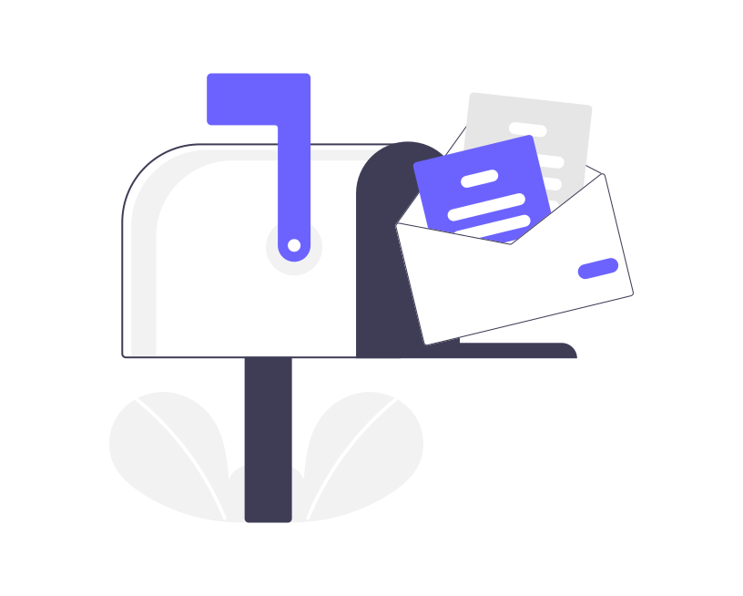

import imageIvoGarofalo from '@/images/team/ivo-garofalo.jpeg'
import imageKari_1 from './kari_1.png'
import imageKari_2 from './kari_2.png'
import imageKari_3 from './kari_3.png'

export const article = {
  date: '2023-05-9',
  title: "Kari's Quest for Seamless Health Data Access",
  description:
    'Kari, a 60-year-old Norwegian, faces challenges with fragmented medical records. Her journey highlights the need for a unified health data system.',
  author: {
    name: 'Ivo garofalo',
    role: 'Co-Founder / CEO',
    image: { src: imageIvoGarofalo, width: 200, height: 200 },
  },
}

export const metadata = {
  title: article.title,
  description: article.description,
}

<Typography>

Kari, a 60-year-old from a picturesque Norwegian town, has been navigating health challenges, leading her to multiple medical consultations. This journey has resulted in a myriad of patient records dispersed across various healthcare systems.

Upon learning of an upcoming appointment with a new specialist, she's determined to provide a holistic view of her medical history. Despite her efforts, consolidating her health data becomes an overwhelming endeavor.

 

She finds her records in both paper and digital formats, with some inaccessible or requiring individual institution outreach. This tedious process frustrates Kari, who wishes to be proactive about her health.

At the clinic, a secretary informs her of the specialist's incomplete view of her medical history. Missing recent test results and notes, the appointment faces postponement. Kari's anxiety rises, recognizing the implications of potential treatment delays and misdiagnoses.

 

Her pursuit of the missing records becomes a bureaucratic maze, replete with repeated explanations and formalities. Kari's experience echoes the difficulties many face in accessing and consolidating health data.

Enter the collaboration between Viken Blockchain Solutions and Zyberia. With the "HealthB" platform, they aim to harness blockchain technology, centralizing health data for enhanced security, privacy, and accessibility.

 

This innovative platform allows patients like Kari to effortlessly access and share their health data. It promotes improved patient-healthcare provider collaboration, reducing treatment delays and misdiagnosis risks.

 

Viken Blockchain Solutions and Zyberia envision a future where health data is not only accessible and secure but also seamlessly integrated for all stakeholders.

<TopTip>
Join us in unveiling the transformative potential of this partnership. Envision a healthcare future unburdened by data silos, but elevated by technological innovation and collaboration. Dive deeper into our vision by visiting our website.
</TopTip>

</Typography>
